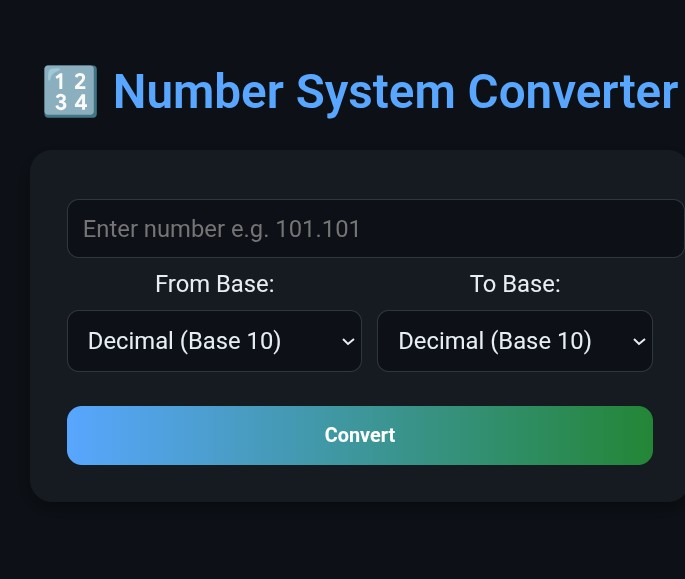

# GROUP W_cat1

# Number System Converter

<h1 align="center">🔢 Number System Converter</h1>

<h3 align="center">GROUP W</h3>

  A web app that automates conversion of numbers between different bases 
  (Binary, Octal, Decimal, Hexadecimal). Supports fractional values and 
  optional base input for flexible conversions.

<h2>🚀 Live Demo</h2>

  

<h2>📂 Repository</h2>

  

<pre>
git clone https://github.com/Loree54/Group_w
</pre>

<pre>
project link https://groupw.netlify.app
</pre>

<h2>📸 Project Preview</h2>

  

<h2>✨ Features</h2>
<ul>
  <li>Convert between <b>Binary, Octal, Decimal, and Hexadecimal</b></li>
  <li>Supports <b>fractional values</b> (e.g., 101.101₂ → 5.625₁₀)</li>
  <li>Optional <b>base input</b> for questions with subscript (e.g., 1101₂, 7A₁₆)</li>
  <li>Clean and colorful UI with clear results</li>
  <li>Deployed on Netlify for easy access</li>
</ul>

<h2>🛠️ Tech Stack</h2>
<ul>
  <li><b>Frontend:</b> React + TailwindCSS</li>
  <li><b>Logic:</b> JavaScript (converter.js)</li>
  <li><b>Deployment:</b> Netlify</li>
</ul>

<h2>👨‍👩‍👧‍👦 Group Members</h2>

This project was successfully developed by <b>GROUP W</b>, with each member contributing fairly:

<ul>
  <li><b>Blair Peter Wachira</b> — <i>CT100/G/21430/24</i></li>
  <li><b>Gitari Dennis Mutwiri</b> — <i>CT100/G/21589/24</i></li>
  <li><b>Lawrence Kibet</b> — <i>CT100/G/21767/24</i></li>
  <li><b>Philip Aticha</b> — <i>CT100/G/22226/24</i></li>
  <li><b>Cynthia Wanjiru Gitau</b> — <i>CT100/G/20299/23</i></li>
</ul>

<h2>⚙️ Run Locally</h2>
<ol>
  <li>Clone repo:
    <pre>git clone https://github.com/Loree54/Group_w</pre>
  </li>
  <li>Install dependencies:
    <pre>npm install</pre>
  </li>
  <li>Start development server:
    <pre>npm run dev</pre>
  </li>
</ol>

<h2>📖 License</h2>

This project is for academic purposes only.

<h2>📖 Special thanks</h2>
<ul>
  <li><a href="https://github.com/blair_wachira" target="_blank" rel="noopener">Blair Peter Wachira</a> - Group Leader</li>
  <li><a href="https://github.com/D30mu" target="_blank" rel="noopener">Gitari Dennis Mutwiri</a> - Member</li>
  <li><a href="https://github.com/Loree54" target="_blank" rel="noopener">Lawrence Kibet</a> - Member</li>
  <li><a href="https://github.com/PhilipAticha" target="_blank" rel="noopener">Philip Aticha</a> - Member</li>
  <li><a href="https://github.com/REPLACE_CynthiaUSERNAME" target="_blank" rel="noopener">Cynthia Wanjiru Gitau</a> - member</li>
</ul>
